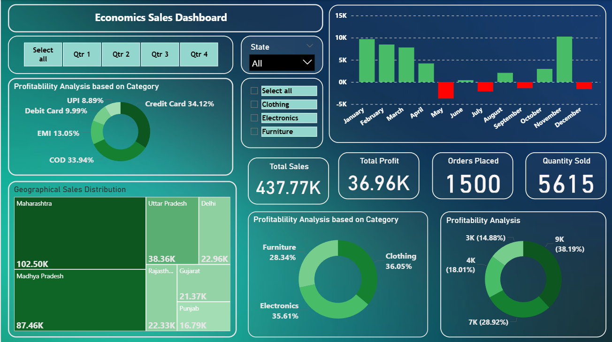

<h1 style="font-size:40px; color:#2E86C1;">📊 Economics Sales Dashboard — Retail Performance & Profitability Analysis</h1>  

<h2 style="font-size:30px; color:#117A65;">📝 Short Description & Purpose</h2>  

The <strong>Economics Sales Dashboard</strong> is a visually engaging Power BI report that delivers a comprehensive overview of retail sales and profitability metrics. It enables quick monitoring of <strong>key performance indicators (KPIs)</strong>, deep dives into <strong>sales trends</strong>, and granular understanding of <strong>profitability by category and location</strong>.
  

Designed for <strong>business analysts, sales managers, and data-driven strategists</strong>, this dashboard supports data-backed decision-making to optimize <strong>sales, marketing, and inventory strategies</strong>.
  

---

<h2 style="font-size:30px; color:#117A65;">🛠️ Tech Stack</h2>  
<ul>
<li><strong>📊 Power BI Desktop</strong> – Primary data visualization tool for report creation.</li>
<li><strong>📂 Power Query</strong> – Data transformation, cleaning, and preparation.</li>
<li><strong>🧠 DAX (Data Analysis Expressions)</strong> – Custom measures & dynamic visuals (e.g., <em>Total Sales</em>, <em>Total Profit</em>).</li>
<li><strong>📝 Data Modeling</strong> – Relationships between sales, product, and geographical datasets for accurate cross-filtering and aggregation.</li>
<li><strong>📁 File Formats</strong> – <code>.pbix</code> for the original report, <code>.png</code> for dashboard previews.</li>
</ul>

---

<h2 style="font-size:30px; color:#117A65;">💾 Data Source</h2>  

Based on a <strong>sample retail dataset</strong> containing:
  
<ul>
<li>Sales transactions</li>
<li>Product categories</li>
<li>Payment types (<em>UPI, Debit Card, COD</em>)</li>
<li>Geographical details (<em>states & cities</em>)</li>
</ul>

---

<h2 style="font-size:30px; color:#117A65;">✨ Features & Highlights</h2>  

<h3 style="font-size:25px;">Business Problem</h3>  

In retail, rapid insights are essential:
  
<ul>
<li>Which products drive the most profit?</li>
<li>How do sales fluctuate over time?</li>
<li>Which regions dominate revenue?</li>
</ul>  

Traditional static reports are slow to answer these questions.
  

<h3 style="font-size:25px;">Goal</h3>  

Deliver a <strong>dynamic, user-friendly dashboard</strong> that:
  
<ul>
<li>Displays KPIs at a glance</li>
<li>Tracks sales trends & profitability</li>
<li>Highlights top-performing states & product categories</li>
<li>Supports informed strategic decisions</li>
</ul>

---

<h2 style="font-size:30px; color:#117A65;">🔍 Walkthrough of Key Visuals</h2>  

<ul>
<li><strong>KPI Cards</strong>:  
  <ul>
    <li>Total Sales – <strong>$437.77K</strong></li>
    <li>Total Profit – <strong>$36.96K</strong></li>
    <li>Orders Placed – <strong>1,500</strong></li>
    <li>Quantity Sold – <strong>5,615</strong></li>
  </ul>
</li>

<li><strong>Time-Series Sales & Profitability</strong> (<em>Column Chart</em>) – Monthly breakdown to identify seasonal patterns and high/low performance periods.</li>

<li><strong>Profitability Analysis by Category</strong> (<em>Donut Charts</em>) – Breakdown by <strong>payment type</strong> and <strong>product category</strong> for profitability insight.</li>

<li><strong>Geographical Sales Distribution</strong> (<em>Treemap</em>) – Sales by <strong>state</strong>, with rectangle size representing sales volume.</li>

<li><strong>Dynamic Filters</strong> (<em>Slicers</em>) – Filter by <strong>quarter</strong>, <strong>state</strong>, and <strong>product category</strong> for targeted analysis.</li>
</ul>

---

<h2 style="font-size:30px; color:#117A65;">🖼 Dashboard Preview</h2>  

