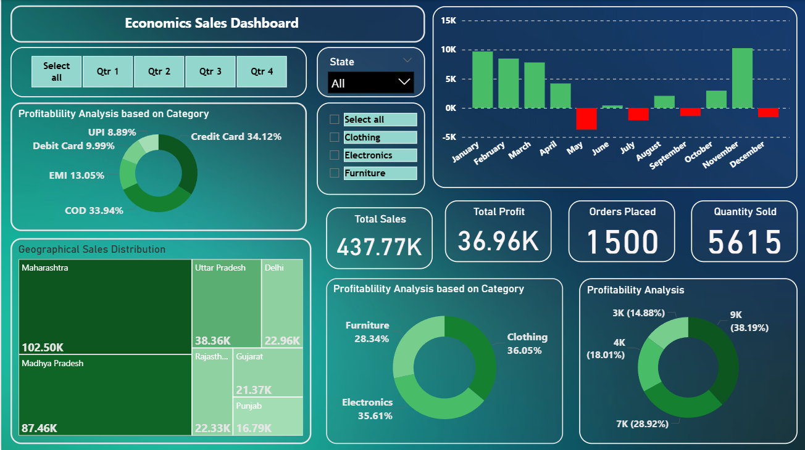

📊 #Economics Sales Dashboard: A Retail Performance and Profitability Analysis
📝 ##Short Description & Purpose
This dashboard is a visually engaging Power BI report designed to provide a comprehensive overview of sales and profitability metrics. It allows users to quickly identify key performance indicators (KPIs), analyze sales trends over time, and understand profitability by category and location. The tool is intended for use by business analysts, sales managers, and data-driven strategists seeking to optimize sales and marketing efforts.

🛠️ ##Tech Stack
The dashboard was built using the following tools and technologies:

📊 ###Power BI Desktop – Main data visualization platform used for report creation.

📂 ###Power Query – Utilized for data transformation, cleaning, and preparation.

🧠 ###DAX (Data Analysis Expressions) – Employed for creating calculated measures and dynamic visuals (e.g., Total Sales, Total Profit).

📝 ###Data Modeling – Relationships established between sales, product, and geographical data to enable cross-filtering and accurate aggregation.

📁 ###File Format – .pbix for the original report and .png for dashboard previews.

💾 ###Data Source
The data is based on a sample retail dataset, including sales records, product categories, payment types (e.g., UPI, Debit Card, COD), and geographical information such as states and cities.

✨ ##Features & Highlights
This section provides a detailed walkthrough of the dashboard's capabilities and the insights it provides.

##Business Problem
In a competitive retail landscape, it's crucial to understand which products are most profitable, how sales are performing over time, and which regions are contributing the most revenue. Without a clear and interactive tool, answering these questions quickly can be difficult.

##Goal of the Dashboard
To deliver a user-friendly and interactive visual tool that:

Enables users to monitor key sales metrics at a glance.

Provides insights into sales trends and profitability by category.

Helps identify top-performing states and product categories.

Supports strategic decisions related to inventory, marketing, and expansion.

###Walkthrough of Key Visuals
Key Performance Indicators (KPIs): Provides a quick summary of essential metrics:

Total Sales: $437.77K

Total Profit: $36.96K

Orders Placed: 1500

Quantity Sold: 5615

###Time-Series Sales & Profitability: A column chart showing monthly sales and profitability over a year, allowing for easy identification of seasonal trends and performance highs and lows.

Profitability Analysis by Category: Donut charts that break down profitability by both payment type and product category.

Geographical Sales Distribution: A treemap visual that displays total sales by state, with the size of each rectangle representing the sales volume.

Dynamic Filters: Interactive slicers for filtering data by quarter, state, and product category, allowing for a personalized and detailed analysis.

🖼️ #Dashboard Preview

